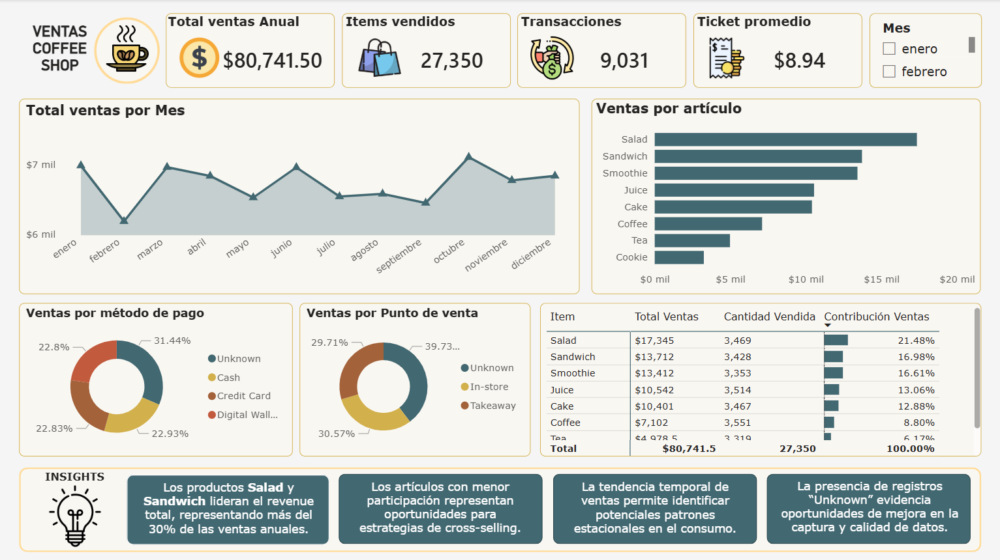
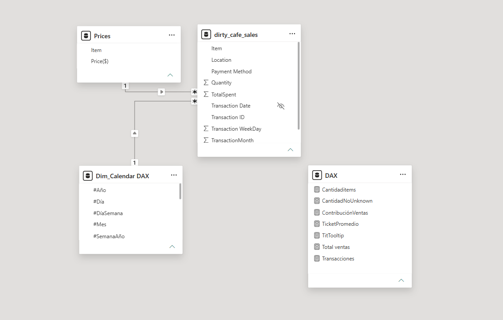

# ☕ Cafe Sales Data Cleaning & Business Intelligence Dashboard
---



---

## 📌 Project Overview

This project focuses on cleaning, transforming, and analyzing a dirty café sales dataset using **Power BI** and **Power Query**.

The dataset was intentionally designed with:
- Missing values
- Invalid entries
- Inconsistent date formats
- Data quality issues

making it an excellent dataset for practicing real-world **data cleaning**, **ETL processes**, and **business intelligence reporting**.

After cleaning the dataset, an interactive Power BI dashboard was developed to uncover sales trends, customer behavior, and product performance insights.

---

# 📂 Dataset Context

The dataset used in this project comes from Kaggle:

🔗 https://www.kaggle.com/datasets/ahmedmohamed2003/cafe-sales-dirty-data-for-cleaning-training

According to the dataset description, the data simulates transactional records from a coffee shop business and was intentionally created with messy and inconsistent values for training purposes.

The dataset includes information related to:
- Transaction dates
- Product names
- Categories
- Quantity sold
- Unit prices
- Payment methods
- Sales revenue

This makes the dataset ideal for practicing:
- Data cleaning
- Data transformation
- Missing value handling
- Exploratory data analysis
- Dashboard development

---

# 🛠 Tools Used

- Microsoft Power BI
- Power Query
- DAX
- Kaggle Dataset

---

# 📋 Dataset Schema

| Column Name | Data Type | Description |
|---|---|---|
| Transaction ID | Text | Unique identifier for each transaction |
| Item | Text | Product sold |
| Category | Text | Product category |
| Quantity | Whole Number | Quantity purchased |
| Price Per Unit | Decimal Number | Unit sale price |
| Total Spent | Decimal Number | Total transaction amount |
| Payment Method | Text | Customer payment method |
| Location | Text | Store or branch location |
| Transaction Date | Date | Date of purchase |

---

# 🧹 Data Cleaning Process (Power Query)

The entire cleaning process was performed in **Power Query**.

---

## ✔ Handling Missing Values

### Numeric Columns
Missing numerical values were treated using:
- Median
- Mean

depending on the data distribution.

### Categorical Columns
Missing text values were replaced using:
- `"Unknown"`
- Most frequent category (mode)

---

## ✔ Handling Invalid Values

Invalid entries such as:
- `"ERROR"`
- `"UNKNOWN"`

were identified and transformed into null values before applying proper cleaning transformations.

---

## ✔ Date Standardization

Date-related issues were solved by:
- Standardizing date formats
- Correcting invalid date values
- Assigning consistent Date data types
- Filling missing dates using nearby logical values

---

## ✔ Data Type Corrections

Incorrect data types were fixed to ensure proper analysis.

### Final Data Types Used
- Date
- Whole Number
- Decimal Number
- Text

---

# Feature Engineering

---

# 📅 Calendar Table Creation

To improve time intelligence analysis and optimize data modeling, a dedicated **Calendar Table** was created in Power BI.

The calendar table allows:
- Better date filtering
- Time-based analysis
- Monthly and yearly comparisons
- Improved DAX calculations
- Proper relationship modeling

The table includes fields such as:

| Column | Purpose |
|---|---|
| Date | Main date reference |
| Year | Year-based analysis |
| Month Number | Correct month sorting |
| Month Name | Readable month labels |
| Quarter | Quarterly analysis |
| Day of Week | Weekly behavior analysis |

The calendar table was connected to the sales table through the `Transaction Date` field to enable efficient reporting and dashboard interactions.

---

# 📊 Dashboard Insights

The Power BI dashboard focuses on identifying key business insights from café sales transactions.

---

# 💰 Revenue Insights

## Total Revenue Analysis
The dashboard highlights total sales revenue generated across all transactions.

### Key Findings
- Monthly revenue trends can reveal seasonality patterns
- Revenue spikes indicate high-demand periods
- Certain months outperform others consistently

### Visuals Used
- KPI Cards
- Line Charts

---

# ☕ Product Performance Insights

## Best-Selling Products
The analysis identifies which products generate the highest demand and revenue.

### Key Findings
- A small group of products contributes most of the sales
- Product demand varies by category
- Some items perform consistently across all months

### Visuals Used
- Bar Charts
- Treemaps

---

# 💳 Customer Behavior Insights

## Payment Method Analysis
The dashboard evaluates customer payment preferences.

### Key Findings
- Customers show clear preferences for specific payment methods
- Digital payments may dominate over cash transactions
- Payment behavior provides operational insights

### Visuals Used
- Donut Charts
- Pie Charts

---

# 🚀 Key Skills Demonstrated

- Data Cleaning
- ETL Processes
- Power Query Transformations
- Data Modeling
- DAX Calculations
- Business Intelligence
- Dashboard Design
- Data Visualization

---

# 📚 Learning Outcomes

This project helped strengthen practical skills in:
- Cleaning messy business datasets
- Handling missing and invalid values
- Creating analytical features
- Building scalable Power BI workflows
- Designing business dashboards

---

# Data Model
---



---

# 📂 Project Structure

```
cafe-sales-data-powerquery-cleaning-powerbi/
│
├── data/
│   ├── raw/
│   │   └── dirty_cafe_sales.csv
│   │
│   └── cleaned/
│       └── clean_cafe_sales.csv
│
├── powerbi/
│   └── Coffee Shop Data Cleaning and Dashboard.pbix
│
├── screenshots/
│   ├── dashboard-preview.png
│   └── data-model.png
│
└──README.md
```

---

# 📬 Author

Aaron Hernandez

Aspiring Data Analyst focused on:
- SQL
- Power BI
- Python
- Data Analytics
- Business Intelligence

---

# ⭐ Support

If you found this project useful, feel free to star the repository.
